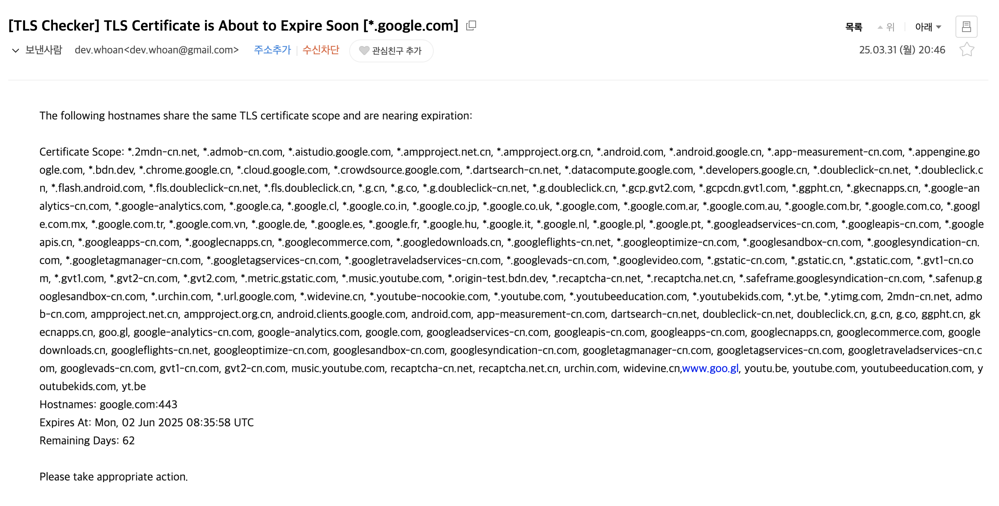

## <center> [ENG](./docs/README_ENG.md) </center>

---

# <center> 🔐 tls-checker </center>

**TLS 인증서 만료일을 감지하고, Slack으로 알림을 전송하는 도구입니다.**

- 2025년 6월 4일 종료되는 Lets Encrypt 인증서 이메일 알림 기능을 대체하고자 본 리포지터리를 생성했습니다.
- 해당 리포지터리를 통해 DevOps/Platform Engineer 혹은 관계자가 직접 관리하는 TLS 시스템을 만들 수 있기를 기대합니다.
- 해당 시스템은 Kubernetes CronJob, AWS Lambda, GCP Cloud Run Job 등 Behaviour Job으로 구성하는 것을 권장합니다.

---

## ✅ 기능
- 지정한 도메인의 TLS 인증서를 검사
- 만료일까지 남은 기간이 지정된 임계치보다 짧으면 Slack 알림 전송
- Block 또는 Attachment 방식으로 Slack 메시지 전송

---

## 🧑‍💻 환경변수

| 변수명 | 설명                                                                             | 예시                       | 필수 여부               |
|--------|--------------------------------------------------------------------------------|--------------------------|---------------------|
| `TLS_EXPIRATION_CHECK_PERIOD` | 검사 기준 남은 일 수<br>인증서의 유효 기간이 해당 값 미만으로 남아있다면 알림 전송                              | `14`                     | 선택 (기본: 14)         |
| `TIMEZONE` | 시간대 (RFC 6557)                                                                 | `Asia/Seoul`             | 선택 (기본: Etc/UTC)    |
| `HOSTNAMES` | 검사할 호스트 목록 (`,` 구분)                                                            | `example.com,foo.com:443` | ✅                   |
|----------| -------------                                                                  |---------|-----------------------------------|
| `SLACK_TOKEN` | Slack 인증 토큰                                                                    | `xoxb-...`               | 선택<br>Slack 전송 시 필수 |
| `SLACK_CHANNEL_ID` | 슬랙 메시지 전송 대상 채널 ID                                                             | `C12345678`              | 선택<br>Slack 전송시  필수 |
| `SLACK_MESSAGE_COLOR_BAR` | 슬랙 메시지의 띠 색상을 지정함<br>해당 값이 설정될 경우 `attachments` 메시지가, 그렇지 않다면 `blocks` 메시지가 전송됨 | RGB 값<br>`#FF0000`       | 선택                  |
|----------| -------------                                                                  |---------|-----------------------------------|
| `EMAIL_TO`         | 이메일 수신자 주소 (`,`로 여러 수신자 설정 가능)                                                 | `alert@example.com`       | 선택<br>이메일 전송 시 필수   |
| `EMAIL_SUBJECT`    | 이메일 제목                                                                         | `TLS 인증서 만료 알림`      | 선택 (기본: `[TLS Checker] TLS Certificate is About to Expire Soon`) |
| `EMAIL_SMTP_HOST`  | SMTP 서버 호스트                                                                    | `smtp.gmail.com`          | 선택<br>이메일 전송 시 필수   |
| `EMAIL_SMTP_PORT`  | SMTP 포트 번호                                                                     | `587`                     | 선택<br>이메일 전송 시 필수   |
| `EMAIL_SMTP_USER`  | SMTP 인증 사용자 이름                                                                 | `user@gmail.com`          | 선택<br>이메일 전송 시 필수   |
| `EMAIL_SMTP_PASS`  | SMTP 인증 비밀번호                                                                   | `yourpassword`            | 선택<br>이메일 전송 시 필수   |
---

## 🏞️ Examples

### 슬랙

- Blocks 메시지 예시
  

- Attachments 메시지 예시 (color: #ccc)
  

### 이메일

- 지메일 SMTP 테스트 예시



---

## 🐳 컨테이너 실행 방법

### 슬랙 메시지로 알림 받기
```bash
docker run --rm -e TIMEZONE="Asia/Seoul" \
  -e TLS_EXPIRATION_CHECK_PERIOD="14" \
  -e HOSTNAMES="google.com" \
  -e SLACK_TOKEN="..." \
  -e SLACK_CHANNEL_ID="..." \
  -e SLACK_MESSAGE_COLOR_BAR="#FFB914" \
  annuums/tls-checker:latest
```

### 이메일로 알림 받기 (SMTP)
```bash
docker run --rm -e TIMEZONE="Asia/Seoul" \
  -e TLS_EXPIRATION_CHECK_PERIOD="14" \
  -e HOSTNAMES="google.com" \
  -e EMAIL_TO="recipient-1@email.com,recipient-2@email.com,..." \
  -e EMAIL_SMTP_HOST="your smtp host" \
  -e EMAIL_SMTP_PORT="your-email-smtp-port" \
  -e EMAIL_SMTP_USER="your-email@email.com" \
  -e EMAIL_SMTP_PASS="your-email-password" \
  annuums/tls-checker:latest
```
