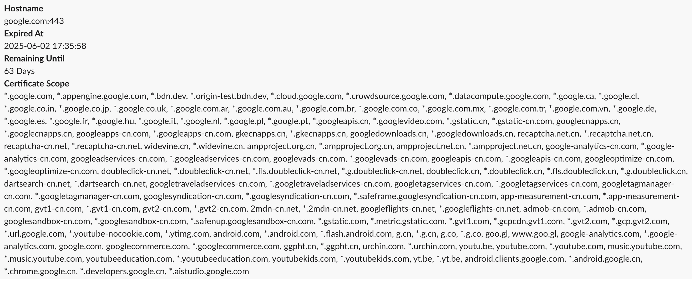

# <center> 🔐 tls-checker </center>

**A tool that checks TLS certificate expiration dates and sends alerts.**

- This repository was created to build a system that can replace the Let's Encrypt certificate expiration system ending on June 4, 2025.
- Through this repository, we hope to enable DevOps/Platform Engineers to directly manage their own TLS systems.
- It is recommended to operate tls-checker on a daily schedule using platforms like Kubernetes CronJob, AWS Lambda, or GCP Cloud Run Job.

---

## ✅ Features
- Checks the TLS certificate of specified domains.
- Sends Slack alerts when the remaining validity is below the configured threshold.
- Supports both Slack `block` and `attachment` message formats.

---

## 🧑‍💻 Environment Variables

| Variable | Description | Example | Required                          |
|----------|-------------|---------|-----------------------------------|
| `TLS_EXPIRATION_CHECK_PERIOD` | Threshold in days. Sends an alert if the remaining validity of the certificate is less than this value. | `14` | Optional (default: 14)            |
| `TIMEZONE` | Timezone used to display expiration timestamps (RFC 6557 format). | `Asia/Seoul` | Optional (default: Etc/UTC)       |
| `HOSTNAMES` | Comma-separated list of hostnames to check. Include port if not `443`. | `example.com,foo.com:443` | ✅ Yes                             |
|----------|-------------|---------|-----------------------------------|
| `SLACK_TOKEN` | Slack OAuth Token. | `xoxb-...` | Optional<br>✅ Yes for Slack Alert |
| `SLACK_CHANNEL_ID` | ID of the Slack channel where messages will be posted. | `C12345678` | Optional<br>✅ Yes for Slack Alert |
| `SLACK_MESSAGE_COLOR_BAR` | RGB color code for the Slack message’s left bar. If set, messages will be sent as `attachments`; otherwise, as `blocks`. | `#FF0000` | Optional                          |
|----------|-------------|---------|-----------------------------------|
| `EMAIL_TO`             | Email recipient(s), comma-separated                                         | `alert@example.com`         | Optional (Required if using Email) |
| `EMAIL_SUBJECT`        | Subject of the email                                                        | `TLS Certificate Expiry`    | Optional (Default: `[TLS Checker] TLS Certificate is About to Expire Soon`) |
| `EMAIL_SMTP_HOST`      | SMTP server host                                                            | `smtp.gmail.com`            | Optional (Required if using Email) |
| `EMAIL_SMTP_PORT`      | SMTP server port                                                            | `587`                       | Optional (Required if using Email) |
| `EMAIL_SMTP_USER`      | SMTP authentication username                                                | `user@gmail.com`            | Optional (Required if using Email) |
| `EMAIL_SMTP_PASS`      | SMTP authentication password                                                | `yourpassword`              | Optional (Required if using Email) |
---

## 🏞️ Slack Message Examples

- blocks message example


- attachments message example (color: #ccc)


---

## 🐳 How to Run Container

### Receive alerts via Slack message

```bash
docker run --rm -e TIMEZONE="Asia/Seoul" \
  -e TLS_EXPIRATION_CHECK_PERIOD="14" \
  -e HOSTNAMES="google.com" \
  -e SLACK_TOKEN="..." \
  -e SLACK_CHANNEL_ID="..." \
  -e SLACK_MESSAGE_COLOR_BAR="#FFB914" \
  annuums/tls-checker:latest
```

### Receive alerts via email (SMTP)
```bash
docker run --rm -e TIMEZONE="Asia/Seoul" \
  -e TLS_EXPIRATION_CHECK_PERIOD="14" \
  -e HOSTNAMES="google.com" \
  -e EMAIL_TO="recipient-1@email.com,recipient-2@email.com,..." \
  -e EMAIL_SMTP_HOST="your smtp host" \
  -e EMAIL_SMTP_PORT="your-email-smtp-port" \
  -e EMAIL_SMTP_USER="your-email@email.com" \
  -e EMAIL_SMTP_PASS="your-email-password" \
  annuums/tls-checker:latest
```

